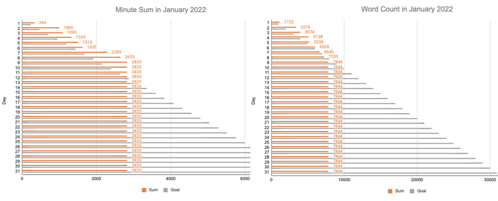
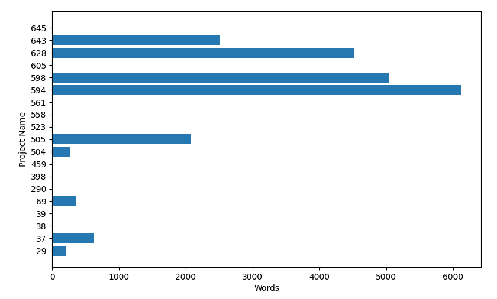

[](https://opensource.org/licenses/MIT)

# writing-progress-2024-25: Track progress on writing projects with bar plots

## Format
Gogole Sheets workbook exported to Excel and ODT.
Either can be imported back into Google Sheets.
I recommend using the Google Sheet variant for faster access for entering daily progress.
Store the link to the workbook in a bookmark, or better yet, in a local index.html file for fast access.

## The problem addressed

Managing multiple writing projects is a significant unsolved problem in academic writing and time management.
Most academics have to make progress on two or more writing projects per day.
The overhead for doing so consumes mental bandwith.
Most books on academic writing skip over this problem because they do not have a good solution for this problem.
I designed the above spreadsheets to address this problem.

Most writing guides suggest tracking the total effort expended on writing per day in terms of minutes spent, word count, or both.
My spreadsheet tracks at the project level so that you can monitor the distribution of your effort.
Word count tends to plateau early when writing academic papers and grant applications so tracking time is more improtant.
The spreadsheets support tracking both.
Like any tool, you can use it well or poorly: good luck!


## Synopsis
The above Open Office Document (writing-progress-2024-25.ods) can be imported into Google Sheets, where it was created. 
You can also open this document in Libre Office or Open Office for offline use. 
The Excel version writing-progress-2024-25.xlsx can be run in Microsoft Excel.
Either docment can be imported into your Google Drive account for faster access as a Google Sheet.
I store a link to the Google Sheet in my web browser for instant access. 

After spending 10-30 minutes customizing the workbook for your current and planned writing projects, you should be set for tracking your writing progress by project for 2024 and 2025. 
It should take no more than a minute a day to make the entries and to check on your monthly progress displayed as bar plots in the right margin, as shown below. 
The sums in the bar plot are taken across all projects.
To check effort on a particular project, open its project sheet and sum over column F for minues and column G for words.


<p align="center"></p>


## Quick start: add today's progress for project 18

1. Open the file.
2. Select project sheet `18`.
3. Enter minutes spent on project 18 in column F and the current day's row.
4. Enter the number of words written on project 18 in column G and the current day's row.
   
You are finished!!  Yes, it is that easy!!!

Note: If you use Voice In Plus, you can map the voice command `open sheet 18` to the code`<open: <insert sheet's url> >` to use your voice to open the project 18's Google Sheet for updating.
I use the command `open project 18` to open the project's website on Overleaf.

You can something similar with Talon Voice or the built Voice Control software on the Mac.


## Checking progress

1. Open sheet min_day. Scroll to right margin. Inspect bar graph for current month. The gray bars are the cumulative goals; the orange bars are the cumulative progress.
2. Repeat with sheet word_day.


## Customization 

1. Edit the sheet tabs to change the project names. This will break the formula in the correspoinding column of the min_day and word_day sheets. Edit the formulas as needed.
2. Edit the column names in sheets `min_day` and `word_day` to refer to the changed project name.


## Adding an eleventh project

1. Create the new project sheet by duplicating an old one and edit to customize.
2. Insert a new project column in sheets `min_day` and `word_day` and edit column name to refer to the new project name.
3. [Optional. Read to the end.] Edit formula in Daily Total column (column E) `min_day` and `word_day` to include the new column in the range of columns so that the progress on this projects gets counted. Note that this formula will be automated updated if you insert the new column at an interior site amoungst the project columns.


## Observations

1. Limit the tracking to those projects that you are committed to finishing in the next two years. The purpose of this tool is sustain your commitment to finishing this projects, not necessarily to document you effort. You can use a writing log for that purpose (see [Writing Log template in LaTeX](https://github.com/MooersLab/writingLogTemplate)).
2. Use integers to name the sheets to save space. Map the project number to the project name in the project sheet.
3. The optimal column width for the projects columns on min_day and word_day sheets is 45 points when using project numbers.
4. Up to 30 projects can be viewed at once. You could always some of the rightmost project columns on  `min_day` and `word_day` sheet to the right of the bar plots to keep the bar plots in view without needing to scroll to the right.


**You are now ready for the next two years!!!!** :)


# Upgrades

## Version 0.4

- Sum formula add to row 733 at the bottom of the columns for the project in sheets `min_day` and `words_day`. 
  The minutes are also converted to hours in these sums.

- Scripts provided to plot cumulative words and time spent by project as bar plots (gs2hbarm.py and gs2hbarw.py) or by day as heatmaps (gs2hmw.py and gs2hmm.py) from the workbook on Google Sheets. Must do one time authorization of access to your Google Drive and Google Sheets. See the Read-the-docs for [gspread](https://docs.gspread.org/en/latest/oauth2.html).


<p align="center"></p>

- I map these scripts to the following easy to remember bash aliases so that I can generate these plots on the fly from the prompt in the terminal.


```bash
# barplots
alias hbh='mp312 ~/gs2hbarm.py'
alias hbw='mp312 ~/gs2hbarw.py' 

# heatmaps.
alias hmh='mp312 ~/gs2hmm.py'
alias hmw='mp312 ~/gs2hmw.py'  
```


# Long form version of the README.md

More details are found [here](https://github.com/MooersLab/writingProgess2023/edit/main/README.md)


# Related links

## Related projects of possible interest

- [Writing Log template in LaTeX](https://github.com/MooersLab/writingLogTemplate). The favored format. LaTeX beginers can use this document easily on Overleaf without any configuration.
- [Writing log template in Org-mode](https://github.com/MooersLab/writingLogTemplateInOrg) Has all of the features of the LaTeX variant. Favored by many Emacs users. Org-mode is a powerful analog of markdown that can interpret LaTeX code blocks. It is vastly more capable than markdown. It even supports literate programming.
- [Writing log template in reStructuredText](https://github.com/MooersLab/writing-log-rst) reStructuredText is used by programmers for documentation.
- [Writing log template in Markdown](https://github.com/MooersLab/writing-log-md) Markdown variant. Read and rendered to PDF by most good text editors.
- [Writing log template in ODT](https://github.com/MooersLab/writing-log-odt) ODT can be read by Open Office, LibreOffice and MS Word.
- [Writing log template in DOCX for MS Word](https://github.com/MooersLab/writing-log-docx) MS Word variant. Probably the least suitable format for this task.
- [Voice computing related repos](https://github.com/MooersLab#voice-computing)
- [LaTeX manuscript template](https://github.com/MooersLab/manuscriptInLaTeX/edit/main/README.md)
- [Org-mode manuscript template](https://github.com/MooersLab/manuscriptInOrg/edit/main/README.md)
- [Slideshow template in LaTeX](https://github.com/MooersLab/slideshowTemplateLaTeX)
- [Annotated bibliography Template in LaTeX](https://github.com/MooersLab/annotatedBibliography)
- [Diary for 2024 in LaTeX](https://github.com/MooersLab/diary2024inLaTeX)
- [latex-emacs profile](https://github.com/MooersLab/latex-emacs)
- [default Emacs profile](https://github.com/MooersLab/configorg)
- [snippets for latex-mode in Emacs](https://github.com/MooersLab/snippet-latex-mode)
- [Quizzes about Emacs to improve recall of keybindings](https://github.com/MooersLab/qemacs)
- [Slides from talk about GhostText, Data Science Workshop, July 2022](https://github.com/MooersLab/DSW22ghosttext)
- [Video link to talk about GhostText, Data Science Workshop, July 2022](https://mediasite.ouhsc.edu/Mediasite/Channel/python/watch/4da0872f028c4255ae12935655e911321d)
- [Slideshow about using LaTeX in Emacs, Berlin Emacs Meetup, 31 August 2022](https://github.com/MooersLab/BerlinEmacsAugust2022)
- [The writer's crede](https://github.com/MooersLab/thewriterslaw)

